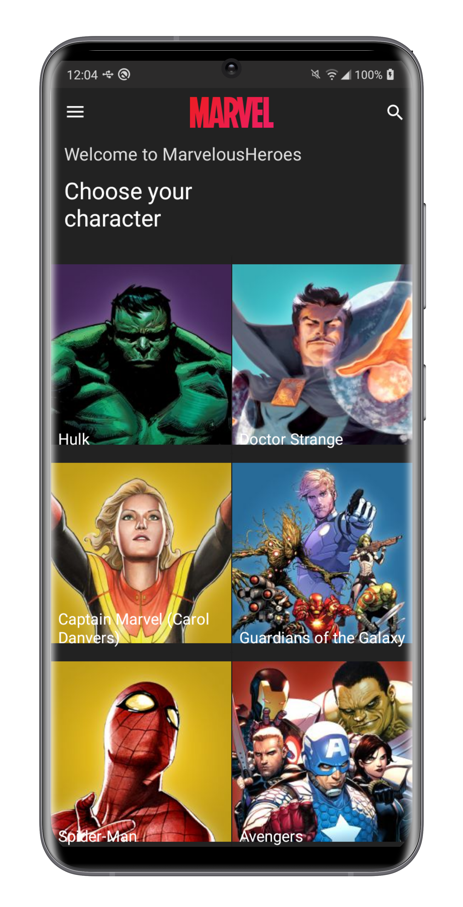
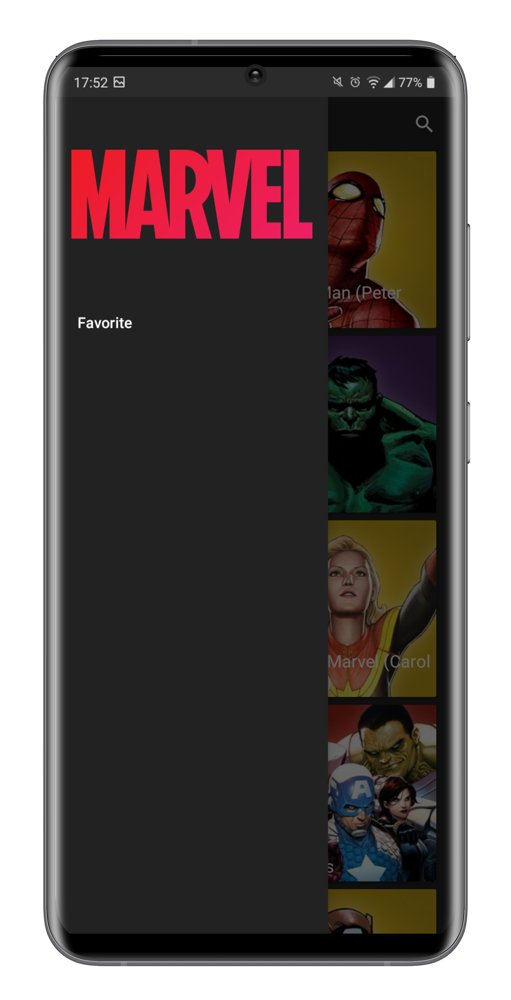
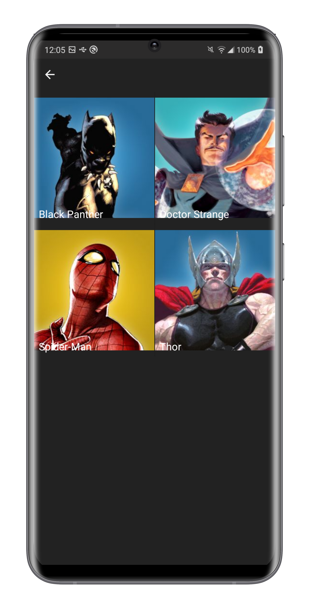
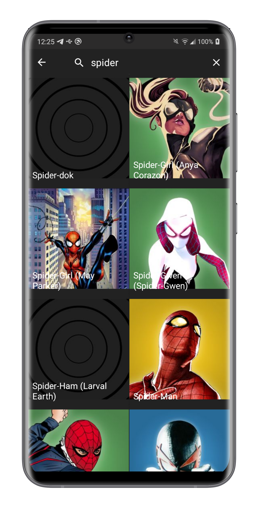

<h1 align="center"> MarvelousHeroes </h1>

<p align="center">
  <a href="https://github.com/ErickLuizA/MarvelousHeroes/graphs/commit-activity" alt="Maintenance">
    
  </a>

  <a href="./LICENSE" alt="License: MIT">
    
  </a>

<br/>


<a href="https://github.com/ErickLuizA/MarvelousHeroes/stargazers">
  
</a>

<p align="center">
  <a href="#clipboard-description">Description</a>&nbsp;&nbsp;&nbsp;|&nbsp;&nbsp;&nbsp;
  <a href="#building_construction-technologies">Technologies</a>&nbsp;&nbsp;&nbsp;|&nbsp;&nbsp;&nbsp;
  <a href="#rocket-getting-started">Getting Started</a>&nbsp;&nbsp;&nbsp;|&nbsp;&nbsp;&nbsp;
  <a href="#memo-license">License</a></a>|&nbsp;&nbsp;&nbsp;
  <a href="#framed_picture-screenshots">Screenshots</a>
</p>
</p>

## :clipboard: Description

MarvelousHeroes is a app built with Kotlin using the Marvel Api based on the [dev challenge](https://www.devchallenge.com.br/challenges/5edabfda693fca2236c83cc7/details)  

## :building_construction: Technologies

- [Kotlin](https://kotlinlang.org/)
  - [Retrofit](https://square.github.io/retrofit/)
  - [Glide](https://bumptech.github.io/glide/)
  - [Dagger-Hilt](https://dagger.dev/hilt/quick-start)
  - [Android Jetpack](https://developer.android.com/jetpack)


## :rocket: Getting Started

## 1. Download the repository

```shell
 $ git clone https://github.com/ErickLuizA/MarvelousHeroes.git
```

## 2. Execution

```shell
 # Run App in Android Studio
```

## :framed_picture: Screenshots

<div>
  
  
  
  
  
</div>

## :information_source: TODO
  - Fix recyclerview bug

## :memo: License

This project is under the MIT license. See the file [LICENSE](LICENSE) for more details.

---

Build with 💙 By [Erick](https://www.linkedin.com/in/erick-luiz-47151a1a4/)
